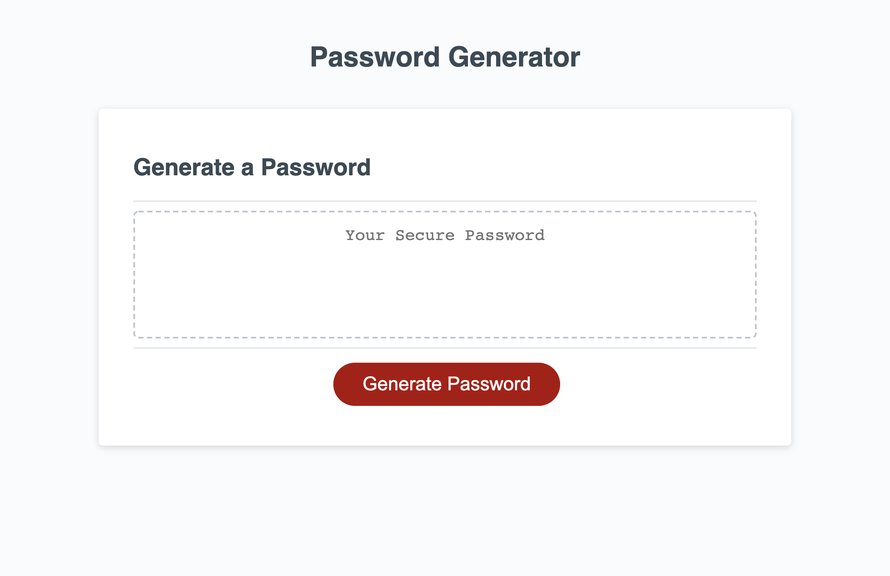

# Password Generator

## Purpose
An application that generates a random password based on criterias.

## Built With
* HTML
* CSS
* JS

## Website
https://jsun994.github.io/password/

## Description
The user clicks the button to generate a password. 
User is then prompted to choose a length of at least 8 characters and no mroe than 128 characters.
User then confirms whether or not to include lowercase, upper case, numberic and special characters.
User must select at least one character type.
Password is generated, meeting the specified criterias.
Password is written to the page.

